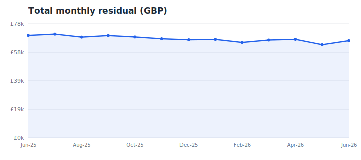
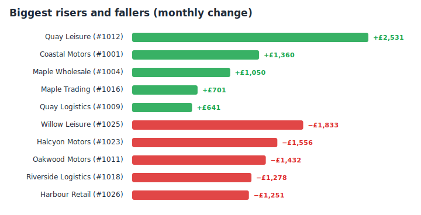

# Partner Performance Reporting Pipeline

Automated Python pipeline that turns monthly partner **"datagrid"** exports into a single, interactive performance report — replacing a manual, multi-spreadsheet process.

> _Synthetic-data demo — the real pipeline runs on confidential partner data which is **not** included here. Everything below runs on randomly generated sample data._

## What it does

Each month the business receives large Excel exports of per-merchant earnings. This pipeline auto-detects new files, computes **residual / turnover / volume** per partner, compiles a tidy time-series, and produces an interactive HTML report with a rolling **baseline-vs-recent** comparison and automatic **riser / faller** detection.

## Total monthly residual



## Biggest movers — baseline vs recent



## How it works

1. Discover monthly `Datagrid-<Month>.xlsx` files.
2. Normalise the earnings column into per-merchant monthly residuals.
3. Compile into one tidy time-series (cached so re-runs are fast).
4. Compare a recent window against a baseline window and rank the biggest movers.
5. Render `Partner_Report.html` with KPI cards, charts and a movers table.

## Run it

```bash
pip install -r requirements.txt
python build_partner_report.py
```

This regenerates the two SVG charts above plus a self-contained `Partner_Report.html`.

## Sample results (synthetic)

- **30 partners** tracked across **13 months**
- Top riser ≈ **+£2.5k / month**, top faller ≈ **−£1.8k / month**
- Rolling 4-month baseline vs 4-month recent comparison window

## Tech

`Python` · `pandas` · `openpyxl` · dependency-free SVG charting

---

_Portfolio demo. No confidential information is included — every figure is randomly generated._
